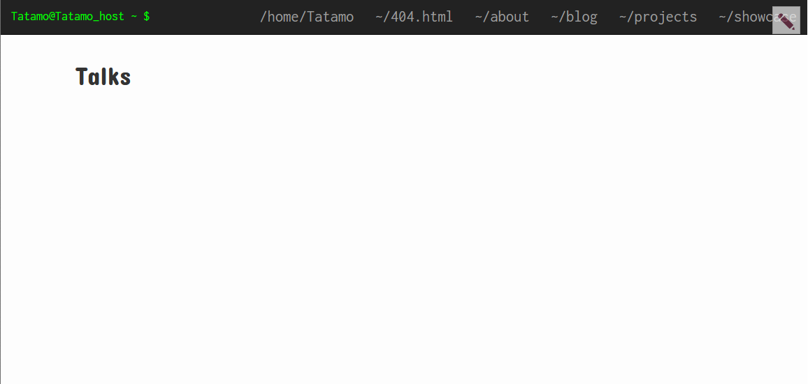
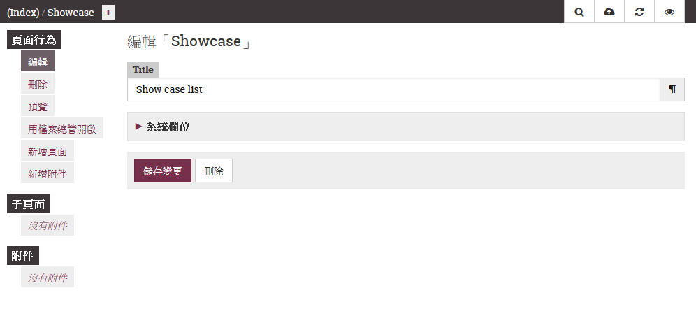
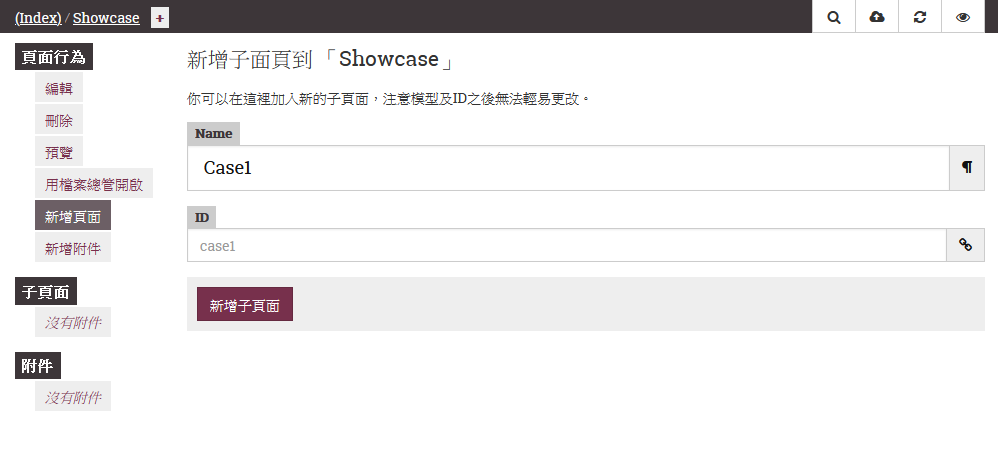
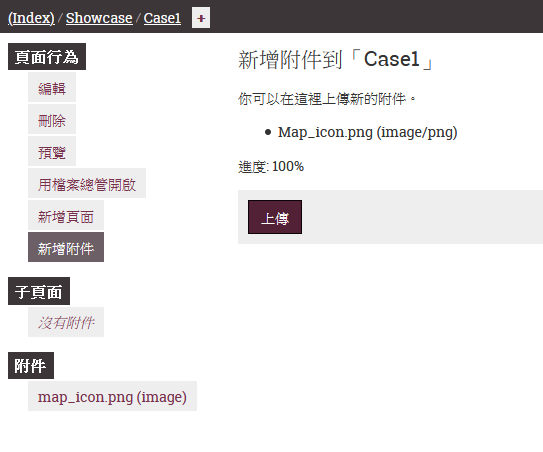
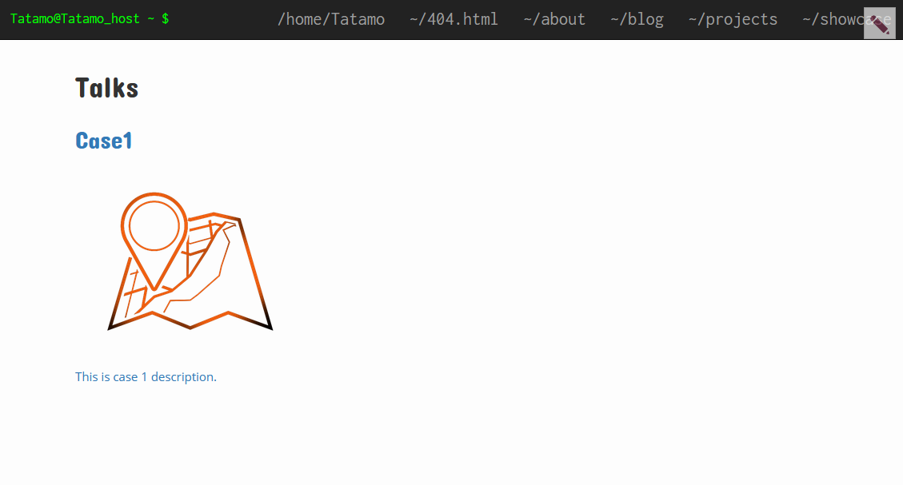

試試showcase
===

上一篇介紹了落落長lektor-theme-nix的祕密後，還是有一些3個檔案是比較不熟的：

1. theme.ini

2. showcase.html

3. showcase-item.html

`theme.ini`會先介紹，然後`showcase.html`及`showcas-item.html`會一起講。

## theme.ini

`theme.ini`在主題建立屬於非必要的檔案，但如果你想要將自訂的主題分享到社群提供其他開發者使用，那`theme.ini`就是必要的檔案囉！來看一下`lektor-theme-nix`的`theme.ini`內容吧：

```ini
[theme]
name = Nix
license = MIT
licenselink = https://github.com/rlaverde/lektor-theme-nix/blob/master/LICENSE.md
description = Simple, minimal theme for Lektor
homepage = https://github.com/rlaverde/lektor-theme-nix
tags = simple, minimal, unix, terminal, blog
features = blog
lektor_required_version = 3.1

[author]
name = rlaverde
homepage = http://rlaverde.github.io/

[original]
author = Matúš Námešný
homepage = https://namesny.com
repo = https://github.com/LordMathis/hugo-theme-nix

[packages]
lektor-disqus-comments = 0.2
```

裡面的資訊基本上就是放入這個主題的基本資訊。`[original]`比較特殊，當你的主題是從其他人分享的主題去改進，那這個項目需要填引用的主題資訊。

## showcase

可以看到`templates`資料夾中有`showcase.html`及`showcas-item.html`；models資料夾中也有`showcase.ini`及`showcas-item.ini`，卻不見`content`資料夾裡有showcase資料夾。所以說在使用quickstart建立基本blog專案，並套入這個主題時，沒有作任何更動，是不會看到showcase出現在網頁中。那這個showcase放在網頁中會長甚麼樣子呢?讓我們來看看！

### model

首先看一下model。model中分別設定了`showcase`及`showcase-item`的model，根據字樣應該是`showcase`為`showcase-item`上層，所以先來看showcase。

```ini
[model]
name = Showcase
label = Showcase
hidden = yes

[fields.title]
label = Title
type = string

[children]
model = showcase-item
order_by = name
```

這邊設定了model的基本屬性`[model]`，資料架構只有一個`title`字串，並指定子層為`showcase-item`，以`showcase-item`的`name`欄位排序。接下來是`showcase-item`：

```ini
[model]
name = Site
label = {{ this.name }}
hidden = yes

[fields.name]
label = Name
type = string
size = large

[fields.url]
label = URL
type = url
width = 1/2

[fields.cover_image]
label = Cover Image
type = select
source = record.attachments.images
width = 1/2

[fields.description]
label = Description
type = markdown
```

`showcase-item`共有`name`, `url`, `cover_image`, `description`這4個欄位，所以之後要建立新的頁面，需注意欄位名稱，或是直接透過網頁來編輯，這就是之後要體驗的lektor強大的地方！

### content

為了要讓lektor讀取到showcase的頁面，contents.lr存在是必要的。因為原本的專案沒有這個資料夾，所以要先建立`showcase`資料夾，並在資料夾中建立contents.lr檔案。

此時就會看到網站中nav bar上出現了`~/showcase`的項目，點下`~/showcase`後看見的是Talks以及一片空白。



到這邊就代表成功建立showcase頁面，lektor也成功讀取到。此時按下右邊的`筆`按鈕，就可以`進入編輯畫面`：



可以看到現在的位置是在showcase的層級(左上角)，在這個頁面可以編輯頁面的資訊，並且可以新增子頁面，這個子頁面就是`showcase-item`所負責的畫面。首先會需要先輸入`Name`及`ID`，我這邊命名為`Case1`。在輸入Name的時候，Lektor自動幫我把ID同時命名了。 



按下新增子頁面後，進入編輯Case1的頁面資訊：

`Name`延續剛剛建立頁面時輸入的值，`url`我則是根據所在的相對路徑輸入，`Cover Image`則可以透過上傳圖片選擇，`Description`則是輸入一小段文字。


到這邊，我們先回憶一下`showcase-item`的model，`showcase-item`共有`name`, `url`, `cover_image`, `description`這4個欄位，在編輯頁面裡也出現相對應的欄位，印證這個頁面與model的關係。

要上傳圖片的話，直接點頁面左側`新增附件`上傳圖片，上傳完可以看見左側附件出現剛剛上傳的檔案名稱：



此時可以回到剛剛的編輯頁面，選擇`Cover Image`出現剛剛上傳的圖片。


按下儲存變更後，畫面中間會直接預覽Case1的頁面，此時可以測試頁面，或直接按右上方的眼睛回到網頁，按下`nav bar`的`~/showcase`項目，就會出現剛剛輸入資訊的`Name`、`Cover Image`、`Description`：



接下來看一下Lektor幫我們做了甚麼事，回到檔案，看到他建立了case1資料夾、conrtents.lr及剛剛上傳的圖片：


在`case1/contents.lr`檔案中，lektor也幫我們建立了剛剛在編輯器中設定的資訊：

```ini
name: Case1
---
description: This is case 1 description.
---
url: /showcase/case1/
---
cover_image: map_icon.png
```

## Bug?

在測試時，我似乎又發現一個bug?在showcase.html中，第15行圖片的地方：

```html
<div class="frame"></div>
```

其中的`.thumbnail(480)`需要砍掉，圖片才能正常顯示喔！

連續兩天找到bug了，不知道明天會不會有呢(?)

下一篇將`content`, `model`, `template`的關係說明一遍。