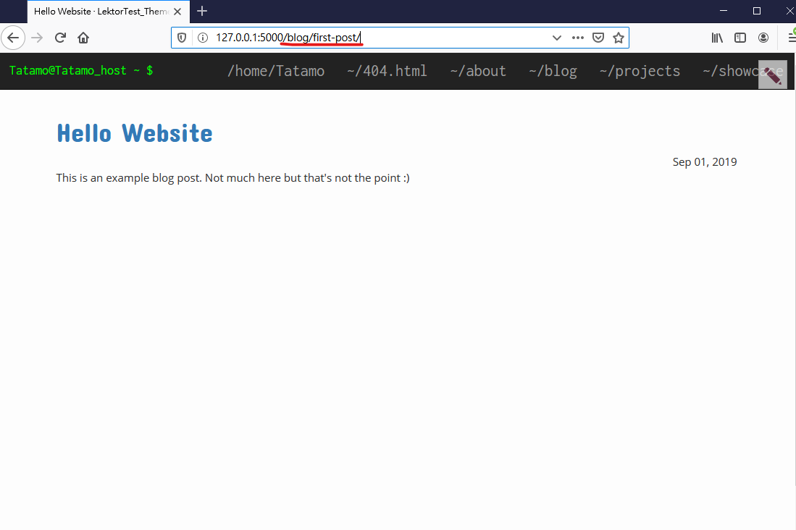
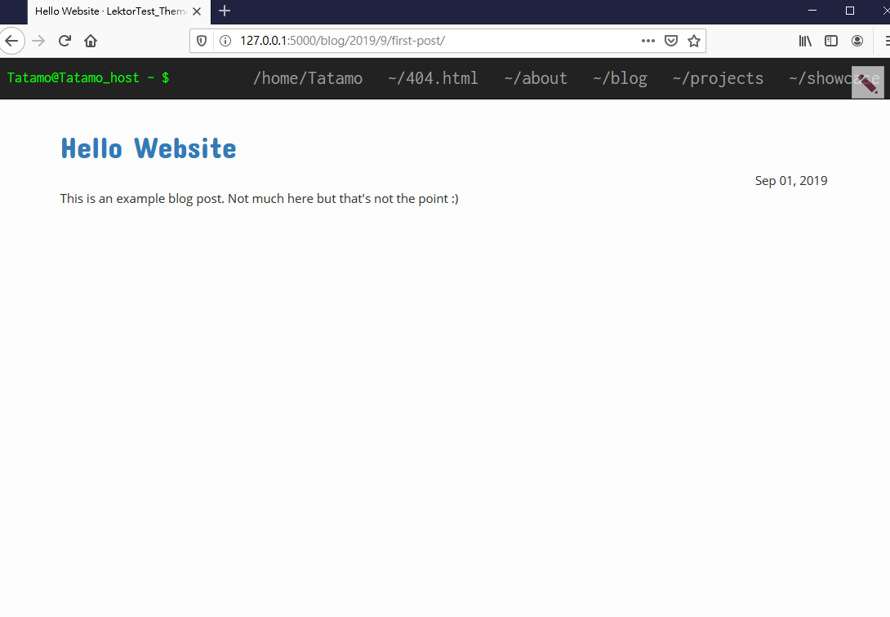

# 快速指南之想寫部落格?Lektor也沒問題！

Lektor官網提供了快速指南，針對常用功能撰寫了比較詳細的說明文件，接下來這10天將快速看過一遍！

今天要來介紹的是部落格功能，這個功能在之前使用quickstart時已經接觸許多，這邊再統一說明，讓你對Blog的功能更清楚。說明流程將由Model開始，接著提到template，最後才是content。

## Model

一般的部落格規劃中，會有一個列表畫面，點列表中的其中一篇文章，才會進入檢視該文章內容。因此部落格功能需要建立2個model，這裡分別命名為`blog.ini`及`blog-post.ini`，一個管理列表，一個管理文章。

### blog.ini

以下為部落格的model內容，裡面除了設定`blog-post.ini`為其子項目(`[children]`)，並設定排序方式(`order_by`)，也設定了每一頁顯示的文章數量(`per_page`)。除此之外，`hidden`使得新增頁面時無法選擇此model作為頁面(按下鉛筆圖案後的介面)，等同於無法新增同樣為blog的網頁；`protected`則保護blog model不被刪除。

```ini
[model]
name = Blog
label = Blog
hidden = yes
protected = yes

[children]
model = blog-post
order_by = -pub_date, title

[pagination]
enabled = yes
per_page = 10
```

### blog-post.ini

`blog-post`為部落格文章的model。每筆資料包含`標題(title)`、`日期(pub_date)`、`作者(author)`及`內文(body)`其中`title`及`pub_date`在`blog.ini`有引用到，作為排序使用。

```ini
[model]
name = Blog Post
label = {{ this.title }}
hidden = yes

[fields.title]
label = Title
type = string
size = large

[fields.pub_date]
label = Publication date
type = date
width = 1/2

[fields.author]
label = Author
type = string
width = 1/2

[fields.body]
label = Body
type = markdown
```


## Templates

### blog.html

第1行使用`layout.html`的模板，第2行則是引入分頁的模組，`pagination`的使用邏輯會在後面的文章說明。在`layout.html`中有`title`及`body`2個block，所以`blog.html`中也會針對這2個block填入要顯示的資訊。

```jinja2


My Blog

  <h1>My Blog</h1>

  <ul class="blog-index">
  
    <li>
      <a href="{{ post|url }}">{{ post.title }}</a> —
      by {{ post.author }}
      on {{ post.pub_date|dateformat }}
    </li>
  
  </ul>

  
    {{ render_pagination(this.pagination) }}
  

```

### blog-post.html

blog-post顯示文章內容，所以跟blog.html比就沒有`pagination`的需要。同時在`title`及`body`2個block填入要顯示的資訊。

```jinja2

{{ this.title }} | My Blog

  <h1>{{ this.title }}
  <p class="meta">
    by {{ this.author }}
    on {{ this.pub_date|dateformat('full') }}
  <div class="body">{{ this.body }}</div>

```

## Contents

完成了model及template還不夠，少了contents.lr，就無法在網頁中看到，所以要在`content/`資料夾中加入部落格的頁面資料夾，假設命名`blog`，則在blog資料夾中建立contents.lr，如此一來就能讀取到blog.html。在contents.lr中寫入以下程式碼，指定model為blog：

### blog/content.lr

```ini
_model: blog
```

此時就可以在網頁中看到blog的畫面，也能在編輯頁面中建立文章。


## 修改URL架構

以quickstart建置的blog專案，裡面包含一篇文章`first-post`，預設的URL為`http://127.0.0.1:5000/blog/first-post/`



想要改URL架構，可以在`blog.ini`檔案中將這段文字加到`[children]`項目中：
```
slug_format = {{ (this.pub_date|dateformat('YYYY/M/') if this.pub_date) ~ this._id }}
```

```ini
[model]
name = Blog
label = Blog
hidden = yes
protected = yes

[children]
model = blog-post
order_by = -pub_date, title
slug_format = {{ (this.pub_date|dateformat('YYYY/M/') if this.pub_date) ~ this._id }}

[pagination]
enabled = yes
per_page = 10
```

這個slug_format設定URL架構包含文章的年份及日期，以下是修改後的URL路徑：



可以看到路徑改為`/blog/2019/9/first-post/`

看完之後我想blog這個功能對你來說已經駕輕就熟了吧！