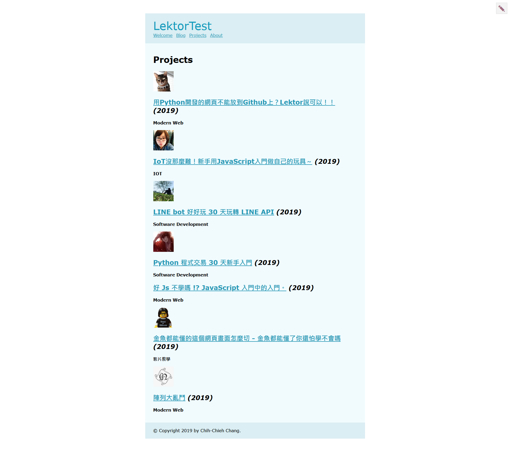

# 網頁創世紀，一篇說完Lektor網頁建置！

**projects.ini**

今天這一篇又要來把重中之重的網頁架構再來說一遍了!!

在經過這幾天的了解(折磨?)之後，發現Lektor真的提供很大的開放性，修改上也十分簡單。只要掌握好整個網頁的建置邏輯、流程，基本上就差不多了，所以今天要再來介紹一次建立網頁的方式。

## Models

在開始之前呢，要先說明一下今天的情境。我想要建立一個可以列出我的所有專案的網站。

首先要建立一個專案預覽頁面，這一頁將告訴`Lektor`我要放在專案預覽頁面下的子頁面為`project`，並且這一頁不能被其他頁面使用(`hidden`)，也不能被刪除(`protected`)。因為有設定`hidden = yes`，所以等一下要先建立content才能使用。在確認這樣的邏輯之後，我們先建立專案預覽頁面的model：

**projects.ini**

專案預覽頁面只會有一個，在Label的地方使用固定的值即可，等一下可以跟子頁面的model比較看看。

```ini
[model]
name = Projects
label = Projects
hidden = yes
protected = yes

[children]
model = project
order_by = -date, name
```

設定完專案預覽頁面後，再來就是子頁面啦~子頁面著重於你想要在頁面中顯示那些資訊，通常設定會有：`標題`、`內文`、`時間`、`類型`、`專案網站`等資訊，並提供附件上傳。所以接下來要建立子頁面的model，並在model中設定要顯示資訊的項目屬性：

**project.ini**

```ini
[model]
name = Project
label = {{ this.name }}
hidden = yes

[attachments]
order_by = _id

[fields.name]
label = Name
type = string
size = large

[fields.date]
label = Date
type = date
size = 1/4

[fields.type]
label = Project type
type = string
size = 1/4

[fields.website]
label = Website
type = url
size = 1/2

[fields.description]
label = Description
type = markdown
```

## Templates

**projects.html**

=======
建立完model後，再來就是設定版面啦！

**projects.html**

這邊除了將專案排列顯示出來，若附件有照片的話則會顯示照片，並透過`imagemagick`調整圖片大小。

再來設定子頁面的版面：

```html

{{ this.name }} ({{ this.date.year }})

  <h1>{{ this.name }}</h1>
  <dl>
    <dt>Date
    <dd>{{ this.date|dateformat }}
    
    <dt>Website
    <dd><a href="{{ this.website }}">{{ this.website.host }}</a>
    
    <dt>Project type
    <dd>{{ this.type }}
  </dl>
  <h2>Description</h2>
  <div class="description">{{ this.description }}</div>
  
  
    <h2>Images</h2>
    
      <div class="image">
        
        
        <p class=meta>
          {{ image.exif.camera }}
          
            ({{ image.exif.created_at|dateformat }})
          
        
      </div>
    
  

```

# 成果

於是我照著上面的步驟成功建立了網頁，同時將我們團員的文章各自建立一個專案，順便宣傳一下我們團隊的系列文，請大家多多訂閱喔！



版面是不是很醜，沒關係，今天這篇只是教你如何建立這樣的網頁，之後也不會教你怎麼排版喔(?)

想切出美美的版面，可以到下面進入`CSScoke`的文章學習，金魚都懂了你應該可以學會。如果還是不懂的話，那你可以聯絡`CSScoke`報名暴力班！

## 小小bug

這個bug在之前就有遇到，就是`image.thumbnail(640)|url`使得網頁中無法正常顯示圖片，當初是刪掉後面的`.thumbnail(640)`就可以正常顯示。`.thumbnail(640)`是讓`imagemagick`去掌控圖片的大小，透過這樣的方式可以快速調整圖片的大小，統一圖片規格。

查詢之後發現這應該是windows的bug，在github上有[issue](https://github.com/lektor/lektor/issues/362)，windows安裝`imagemagick` 後依舊無法讓lektor使用。有人回覆修復方式，但我去下載程式後安裝也沒有看到他所說的選項，所以還是沒有試成功。

# 團隊系列文

CSScoke - [金魚都能懂的這個網頁畫面怎麼切 - 金魚都能懂了你還怕學不會嗎](https://ithelp.ithome.com.tw/users/20112550/ironman/2623)
King Tzeng - [IoT沒那麼難！新手用JavaScript入門做自己的玩具～](https://ithelp.ithome.com.tw/users/20103130/ironman/2125)
Hina Hina - [陣列大亂鬥](https://ithelp.ithome.com.tw/users/20120000/ironman/2256) 
阿斬 - [Python 程式交易 30 天新手入門](https://ithelp.ithome.com.tw/users/20120536/ironman/2571)
Clarence - [LINE bot 好好玩 30 天玩轉 LINE API](https://ithelp.ithome.com.tw/users/20117701/ironman/2634)
塔塔默 - [用Python開發的網頁不能放到Github上？Lektor說可以！！](https://ithelp.ithome.com.tw/users/20112552/ironman/2735)
Vita Ora - [好 Js 不學嗎 !? JavaScript 入門中的入門。](https://ithelp.ithome.com.tw/users/20112656/ironman/2782)
