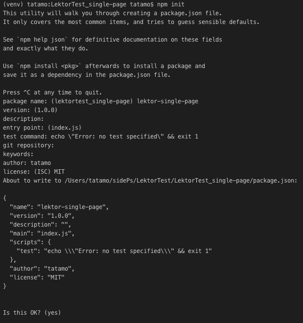

# 老闆我要打包，Lektor也能用webpack

如果還不知道什麼是webpack，可以參考[這裡](https://medium.com/i-am-mike/%E4%BB%80%E9%BA%BC%E6%98%AFwebpack-%E4%BD%A0%E9%9C%80%E8%A6%81webpack%E5%97%8E-2d8f9658241d)。以下直接說明怎麼使用lektor建立webpack！

## 設定webpack

### package.json

lektor有建立webpack外掛，因此在使用前須先將webpack加入外掛中：

```
$ lektor plugins add webpack-support
```

此時在`.lektorproject`檔案中就會出現已安裝外掛的資訊：

```ini
[project]
name = LektorTest

[packages]
lektor-webpack-support = 0.5
```

接著使用npm建立package.json，相關資訊可參考[npm-init](https://docs.npmjs.com/cli/init)：

```
$ npm init
```

執行後，命令列會問你一些關於專案的資訊：



生成的package.json檔會長成這樣：

```json
{
  "name": "lektor-single-page",
  "version": "1.0.0",
  "description": "",
  "main": "index.js",
  "scripts": {
    "test": "echo \\\"Error: no test specified\\\" && exit 1"
  },
  "author": "tatamo",
  "license": "MIT"
}
```

接著使用npm install安裝相關套件：

```
$ npm install --save-dev webpack babel-core node-sass babel-loader sass-loader css-loader url-loader style-loader file-loader extract-text-webpack-plugin
```

安裝完後的package.json會增加：

```json
{
  "name": "lektor-single-page",
  "version": "1.0.0",
  "description": "",
  "main": "index.js",
  "scripts": {
    "test": "echo \\\"Error: no test specified\\\" && exit 1"
  },
  "author": "tatamo",
  "license": "MIT",
  "devDependencies": {
    "babel-core": "^6.26.3",
    "babel-loader": "^8.0.6",
    "css-loader": "^3.2.0",
    "extract-text-webpack-plugin": "^3.0.2",
    "file-loader": "^4.2.0",
    "node-sass": "^4.12.0",
    "sass-loader": "^8.0.0",
    "style-loader": "^1.0.0",
    "url-loader": "^2.2.0",
    "webpack": "^4.41.0"
  }
}
```

### webpack/webpack.config.js

在webpack資料夾中建立`webpack.config.js`：

```js
var webpack = require('webpack');
var path = require('path');
var ExtractTextPlugin = require('extract-text-webpack-plugin');

module.exports = {
  entry: {
    'app': './js/main.js',
    'styles': './scss/main.scss'
  },
  output: {
    path: path.dirname(__dirname) + '/assets/static/gen',
    filename: '[name].js'
  },
  devtool: '#cheap-module-source-map',
  resolve: {
    modules: ['node_modules'],
    extensions: ['.js']
  },
  module: {
    rules: [
      { test: /\.js$/, exclude: /node_modules/,
        loader: 'babel-loader' },
      { test: /\.scss$/,
        loader: ExtractTextPlugin.extract({
          fallback: 'style-loader',
          use: 'css-loader!sass-loader' } ) },
      { test: /\.css$/,
        loader: ExtractTextPlugin.extract({
          fallback: 'style-loader',
          use: 'css-loader' } ) },
      { test: /\.(woff2?|ttf|eot|svg|png|jpe?g|gif)$/,
        loader: 'file' }
    ]
  },
  plugins: [
    new ExtractTextPlugin({
      filename: 'styles.css',
      allChunks: true
    }),
    new webpack.optimize.UglifyJsPlugin()
  ]
};
```

## 建立App

新增`webpack/js/main.js` 及 `webpack/scss/main.scss` 2個空檔案，在建立App後，會生成`js/main.js`and `scss/main.scss`。

## 伺服器上執行

在一切設定完之後，使用以下指令執行專案：

```
$ lektor server -f webpack
```

## build專案

此時webpack會自動在`assets/static/gen`建立資料，提供lektor使用。確認運行正常，就可以build專案了！

```
$ lektor build -f webpack
```

## 在template中讀取

接下來可以在template使用webpack生成的檔案，以下為生成`css`及`js`檔案的應用範例：


```html
<link rel="stylesheet" href="{{
  '/static/gen/styles.css'|asseturl }}">
<script type=text/javascript src="{{
  '/static/gen/app.js'|asseturl }}" charset="utf-8"></script>
```

# 團隊系列文

CSScoke - [金魚都能懂的這個網頁畫面怎麼切 - 金魚都能懂了你還怕學不會嗎](https://ithelp.ithome.com.tw/users/20112550/ironman/2623)
King Tzeng - [IoT沒那麼難！新手用JavaScript入門做自己的玩具～](https://ithelp.ithome.com.tw/users/20103130/ironman/2125)
Hina Hina - [陣列大亂鬥](https://ithelp.ithome.com.tw/users/20120000/ironman/2256) 
阿斬 - [Python 程式交易 30 天新手入門](https://ithelp.ithome.com.tw/users/20120536/ironman/2571)
Clarence - [LINE bot 好好玩 30 天玩轉 LINE API](https://ithelp.ithome.com.tw/users/20117701/ironman/2634)
塔塔默 - [用Python開發的網頁不能放到Github上？Lektor說可以！！](https://ithelp.ithome.com.tw/users/20112552/ironman/2735)
Vita Ora - [好 Js 不學嗎 !? JavaScript 入門中的入門。](https://ithelp.ithome.com.tw/users/20112656/ironman/2782)