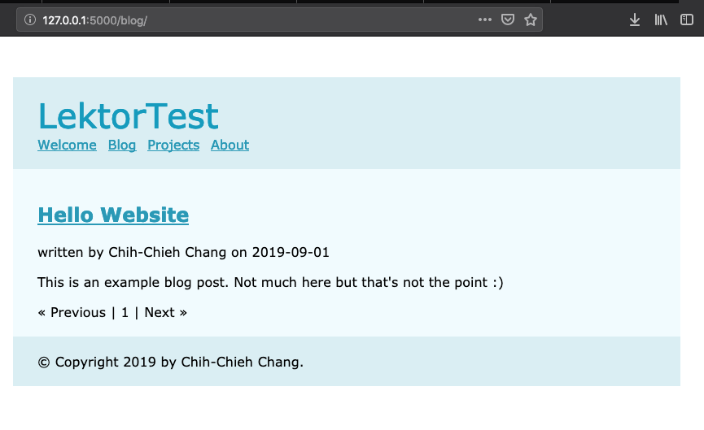

Lektor專案透視鏡，皮肉骨一次看清
======

讓我們先看一下Lektor quickstart blog範例的整個專案架構，進入專案資料夾中，會看到`1個檔案及4個資料夾`：

```
.
|____LektorTest.lektorproject
|____content
|____models
|____templates
|____assets
```
以下做簡單的介紹，
- LektorTest.lektorproject
    - 專案設定檔
- content
    - 放置網頁內容檔案，透過`models`分析，並渲染到`templates`。
- models
    - 這邊的models就跟Django很像。Lektor透過models的設定，建立起強大的藍圖，使靜態網頁動態化的功能。
- templates
    - 使用templates，可建立網站模板，有效的運用template可以讓網站開發更加有效率。
- assets
    - 跟一般網頁規則差不多，放置靜態文件如`css`等。

大致了解整個架構之後，接下來開始說明各個項目的細節吧，首先是`*.lektorproject`，也就是專案設定檔！

## Project File

`Project File`我稱為專案設定檔，裡面放置此專案的相關資訊。當使用`quickstart`建立專案後，此檔案會以專案名稱為檔名，副檔名則為`.lektorproject`。

我在建立專案時命名為`LektorTest`，因此這邊的專案檔即為`LektorTest.lektorproject`。打開檔案，裡面只包含一個資訊，也就是專案名稱：
```
[project]
name = LektorTest
```
除了這個參數以外，Lektor也提供了許多參數可以設定：
- [project]
- [packages]
- [servers.\*]
- [alternatives.\*]

### [project]

`[project]`控制專案的基本資料，包含以下項目可以設定：

| 項目           | 說明                                                         |
| -------------- | ------------------------------------------------------------ |
| name           | 專案名稱。此項目可以被Lektor用在網站中，像是編輯模式裡面的標題（經實際測試，將專案名稱修改後，網頁中並沒有出現變動或是更新後的專案名稱，詳細使用方式可能還要再確認。） |
| locale         | 設定場所，或者說是時區，預設為`en_US`，提供Lektor判斷時區之設定。 |
| url            | 設定主網址。                                                 |
| url_style      | 設定網站中各個網頁網址樣式，分為`relative`, `absolute`及`external`三種，預設為`relative`。 |
| path           | 設定檔案的路徑。當沒有額外設定時，Lektor會將檔案存放於專案特定資料夾中，但如果你要想將檔案放置於專案資料夾外，可能是為了方便管理，或是不想要變成版本控制的資料之一，就可以透過設定path指定你想要的檔案存放路徑。 |
| exclued_assets | 設定排除的檔案規則，預設`_`及`.`開頭的檔案，無法從`assets`資料夾中複製。<br />以逗號區隔各式規則。 |
| inclued_assets | 當有檔案符合排除的檔案規則，卻有複製的需求，可以將檔名加入到此項目中，作為例外的檔名。<br />以逗號區隔各式規則。 |

以下為官網提供的範例，可以看到設定內容，專案名稱為`My Website`，網址為`https://www.mywebsite.invalid/`，時區設定在德國，副檔名為`.backup`及檔案以`~`結尾的檔案均無法複製，而`_special_file`則設定為例外檔案。

```ini
[project]
name = My Website
url = https://www.mywebsite.invalid/
locale = de_DE
excluded_assets = *.backup, *~
included_assets = _special_file
```

#### url_style

前面有提到url_style有三種形式，這裡稍作說明：

- relative

  首先是預設的設定，網址的路徑會與網頁的路徑為主，他的網址樣式如下：

  

- absolute

  以檔案與主頁的絕對路徑顯示。

- external

  當有設定`url`的路徑時，可以設定url_style為external，提供給有網址設定特殊需求的管理者使用。

### [packages]

此處可設定套件，或稱作是外掛，安裝於此專案中。輸入套件名稱為參數名稱，其值為版本編號：

```ini
[packages]
lektor-webpack-support = 0.1
```

### [servers.\*]

此項目提供部署設定，當開發時若有測試機及正式機等兩個以上的伺服器部署時，可以利用此項目建立不同伺服器的設定，並且在部署時增加設定的名稱（取代`*`的部分），Lektor就會依照該名稱的設定內容進行部署。例如我完成正式機的部署設定如下，我就可以透過`$ lektor deploy production`的方式將專案部署到伺服器上：

```ini
[servers.production]
name = Production
enabled = yes
default = yes
target = rsync://server/path/to/folder
```
因為`server.production`在這邊設定為default，在輸入命令時也可以直接省略名稱：`$ lektor deploy`

### [alternatives.\*]

當網頁有多語言需求的時候可以使用，預設為關閉，也就是沒有多語言選項。
以下為建立`en`及`fr`兩種語言的範例：

```ini
[alternatives.en]
name = English
primary = yes
locale = en_US

[alternatives.fr]
name = French
url_prefix = /fr/
locale = fr
```

# 團隊系列文
CSScoke - [金魚都能懂的這個網頁畫面怎麼切 - 金魚都能懂了你還怕學不會嗎](https://ithelp.ithome.com.tw/users/20112550/ironman/2623)
King Tzeng - [IoT沒那麼難！新手用JavaScript入門做自己的玩具～](https://ithelp.ithome.com.tw/users/20103130/ironman/2125)
Hina Hina - [陣列大亂鬥](https://ithelp.ithome.com.tw/users/20120000/ironman/2256) 
阿斬 - [Python 程式交易 30 天新手入門](https://ithelp.ithome.com.tw/users/20120536/ironman/2571)
Clarence - [LINE bot 好好玩 30 天玩轉 LINE API](https://ithelp.ithome.com.tw/users/20117701/ironman/2634)
塔塔默 - [用Python開發的網頁不能放到Github上？Lektor說可以！！](https://ithelp.ithome.com.tw/users/20112552/ironman/2735)
Vita Ora - [好 Js 不學嗎 !? JavaScript 入門中的入門。](https://ithelp.ithome.com.tw/users/20112656/ironman/2782)