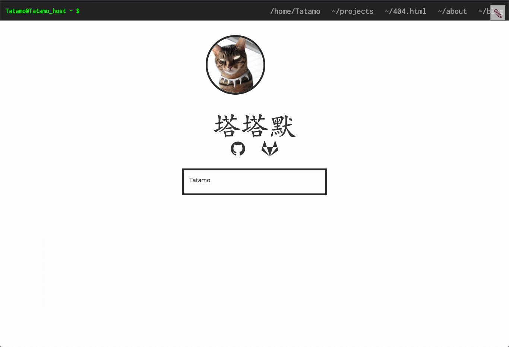

教你如何穿衣服，lektor-theme-nix設定
===

在使用這個主題的時候，先看看[README](https://github.com/rlaverde/lektor-theme-nix/)裡面寫了什麼，在使用前先讀取README是個好習慣！要完全使用這個主題的所有功能，需要完成5個步驟，以下接續說明：

1. 404頁面
2. 主頁
3. 回應（評論）功能
4. 專案檔設定
5. 個人頭像

> 以下設定都是在原本的專案資料夾中，非主題裡面的資料夾，切記切記！

## 404主頁

須在`content`資料夾中建立`404.html`資料夾，並在資料夾中建立`contents.lr`檔案，設定檔案不使用任何model，並指向404.html。`404.html/contents.lr`內容如下：

```ini
_model: none
---
_template: 404.html
```

要這樣設定的原因有2個，第1個原因是lektor預設的model為page.ini，如果沒有設定任何model，那就會指向page.ini，並使用page.html來顯示網頁，所以需要設定`_model: none`才不會變成讀取`page.ini`及`page.html`；第2個原因則是404頁面的網址預設為`http://127.0.0.1/404.html`，與之前看到的網址`http://127.0.0.1/about`不一樣，為了使404網頁有效存取到指定的頁面，才需要在資料夾中包含副檔名。

## 主頁

主頁的設定跟404很像，首先在`content`根目錄下建立`contents.lr`（預設應該已經有了），`不使用任何model`並`指向index.html`，因此`content/contents.lr`內容如下，原本檔案中如果有資料，全部刪除，留著的話Lektor也讀不到喔：

```ini
_model: none
---
_template: index.html
```

## 回應（評論）功能

這個功能可以在網頁中加入[DISQUS](https://disqus.com/)的外掛，讓遊客直接在網頁下方留言，在部落格或是新聞網頁常常看得到。

首先需使用指令安裝：

```
$ lektor plugins add lektor-disqus-comments
```

接下來在專案中新增`config`資料夾，並在資料夾中建立`disqus-comments.ini`，檔案中設定`shortname`，值可以自訂，我這邊設定他為`disqus`：

```ini
shortname = disqus
```

另外必須在`.lektorproject`檔案中完成`comments = yes`設定，才會啟動回應功能喔！可參考下面設定結果的內容～

## 專案檔設定

README中還有提供可以在`.lektorproject`檔案裡面設定的參數，以下資訊有的就放，沒有就刪除。但是`name`、`headerusername`、`headerhostname`、`comments`需要留著，不然頁面會出錯：

```ini
[theme_settings]
githubID = your_github
gitlabId = your_gitlab
twitterID = your_twitter
codepenID = your_codepen
linkedInID = your_linkedin
googleplusID = your_googleplus
facebookID = your_facebook
instagramID = your_instagram
telegramID = your_telegram
name = your_name
headerusername = username
headerhostname = hostname
email = your_email
about = info_about_you
profilepicture = profile_picture_asset_url
googleanalytics = your_google_analytics_id
slackURL = https://join.slack.com/...
comments = yes
```

## 個人頭像

在`assets`資料夾中加入個人頭像的照片，並在`.lektorproject`中的`profilepicture`設定照片路徑。我在`assets/img`中加入個人頭像照片，並命名照片名稱為`profile.png`，因此`.lektorproject`的`profilepicture = img/profile.png`。可參考下面設定結果的內容～

# 設定結果

以下是我設定的`.lektorproject`內容：

```ini
[project]
name = LektorTest_Theme
themes = lektor-theme-nix

[theme_settings]
githubID = HanInfinity
name = 塔塔默
headerusername = Tatamo
headerhostname = Tatamo_host
about = Tatamo
comments = yes
gitlabId = tatamo
profilepicture = img/profile.png

[packages]
lektor-disqus-comments = 0.4.1
```

完成後的首頁就會變成這樣囉！！



設定完才知道，原來左上角的`@ ~ $`是要做成類似終端機的格式，用`headerusername@headerhostname - $`模仿命令列的符號。實際的運作邏輯我們下一篇來探討吧！！