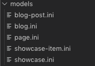

lektor-theme-nix的秘密
===

在使用這個主題的時候，先看看[README](https://github.com/rlaverde/lektor-theme-nix/)裡面寫了什麼，在使用前先讀取README是個好習慣！README中還有提供可以在`.lektorproject`檔案裡面設定的參數：

```ini
[theme_settings]
githubID = your_github
gitlabId = your_gitlab
twitterID = your_twitter
codepenID = your_codepen
linkedInID = your_linkedin
googleplusID = your_googleplus
facebookID = your_facebook
instagramID = your_instagram
telegramID = your_telegram
name = your_name
headerusername = username
headerhostname = hostname
email = your_email
about = info_about_you
profilepicture = profile_picture_asset_url
googleanalytics = your_google_analytics_id
slackURL = https://join.slack.com/...
comments = yes
```

讀完README之後，讓我們來看一下`lektor-theme-nix`如何建立主題的。首先看一下他的架構：


除了前面提到的lektor部分架構：`assets`, `models`, `templates`外，這個主題資料夾中還有一個`theme.ini`檔案。

## assets

首先看到assets資料夾，裡面只放了css檔案，這個檔案裡面設定此主題套用的樣式。


## models

再來看檔案第二多的資料夾`models`，裡面共有5個檔案。其中`blog-post.ini`, `blog.ini`及`page.ini`在前面利用quickstart自動產生的專案中就有提到，檔案內容也跟之前的專案內完全一樣。

但如果在這邊有調整的話，套用主題就會使用這邊的model，就不是原本專案的model囉。



## templates

templates資料夾中包含`macros`及`partials`資料夾，以及許多html檔案。其中`partial`資料夾是第一次看到，資料夾中包含`footer`, `head`, `header`, `social`這5個檔案，讓我們看一下這些檔案之間的關聯吧！


### layout

在看`partial`裡面的檔案前，先看一下`layout`裡面寫了什麼。

```html
<!DOCTYPE html>
<html>
  <head>
    <title> {{ this.title }} &middot; {{ config.PROJECT.name }} </title>
    
  </head>

  <body>
    
    <div class="container wrapper">
    
    
    </div>
    <div class="push"></div>
    
  </body>
</html>
```
可以看到layout共引用了3個檔案，包含下面會提到的`footer`, `head`, `header`。

### footer

`footer`在`layout`中被引用在body的最下方，因此正常情況中也會顯示在網頁的最下層。以下為`footer.html`檔案中的程式碼：

```html
<footer class="footer text-center">
  <p>Copyright &copy; 2017 {{ config.THEME_SETTINGS.name }} -
    <span class="credit">
      Powered by
      <a target="_blank" href="https://www.getlektor.com">Lektor</a>
      and
      <a target="_blank" href="https://github.com/rlaverde/lektor-theme-nix/">Nix</a> theme.
    </span>
  </p>
</footer>
```

這邊用到了`config.THEME_SETTINGS.name`的項目，就會對應到前面提到的`.lektorproject`檔案中。如果有在檔案中設定`[theme_settings]`中的`name`，那生成網站時就會將這個資訊顯示在網頁中。以下是我在`.lektorproject`中的設定：

```ini
[project]
name = LektorTest_Theme
themes = lektor-theme-nix
[theme_settings]
githubID = HanInfinity
name = 塔塔默
headerusername = Tatamo
headerhostname = Tatamo_host
about = Tatamo
comments = no
```

我在檔案中有設定`[theme_settings]`中的`name = 塔塔默`，所以當我套用這個主題時，footer會讀到我設定的值，並顯示在網頁中。

### head

### header

### social