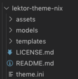

lektor-theme-nix的秘密
===

上一篇介紹如何設定並套用`lektor-theme-nix`主題，現在讓我們來看一下`lektor-theme-nix`如何建立主題的。首先看一下他的架構：



除了前面提到的lektor部分架構：`assets`, `models`, `templates`外，這個主題資料夾中還有一個`theme.ini`檔案。

## assets

首先看到assets資料夾，裡面只放了css檔案，這個檔案裡面設定此主題套用的樣式。


## models

再來看檔案第二多的資料夾`models`，裡面共有5個檔案。其中`blog-post.ini`, `blog.ini`及`page.ini`在前面利用quickstart自動產生的專案中就有提到，檔案內容也跟之前的專案內完全一樣。

但如果在這邊有調整的話，套用主題就會使用這邊的model，就不是原本專案的model囉。


## templates

templates資料夾中包含`macros`及`partials`資料夾，以及許多html檔案。其中`partial`資料夾是第一次看到，資料夾中包含`footer`, `head`, `header`, `social`這5個檔案，讓我們看一下這些檔案之間的關聯吧！


### layout

在Django、Flask及Lektor等應用中，常常會將命名layout的檔案作為網頁主模板，在看`partial`裡面的檔案前，先看一下`layout`裡面寫了什麼。

```html
<!DOCTYPE html>
<html>
  <head>
    <title> {{ this.title }} &middot; {{ config.PROJECT.name }} </title>
    
  </head>

  <body>
    
    <div class="container wrapper">
    
    
    </div>
    <div class="push"></div>
    
  </body>
</html>
```
可以看到layout共引用了3個檔案，包含下面會提到的`footer`, `head`, `header`。

### footer

`footer`在`layout`中被引用在body的最下方，因此正常情況中也會顯示在網頁的最下層。以下為`footer.html`檔案中的程式碼：

```html
<footer class="footer text-center">
  <p>Copyright &copy; 2019 {{ config.THEME_SETTINGS.name }} -
    <span class="credit">
      Powered by
      <a target="_blank" href="https://www.getlektor.com">Lektor</a>
      and
      <a target="_blank" href="https://github.com/rlaverde/lektor-theme-nix/">Nix</a> theme.
    </span>
  </p>
</footer>
```

這邊用到了`config.THEME_SETTINGS.name`的項目，就會對應到前面提到的`.lektorproject`檔案中。如果有在檔案中設定`[theme_settings]`中的`name`，那生成網站時就會將這個資訊顯示在網頁中。以下是我在`.lektorproject`中的設定：

```ini
[project]
name = LektorTest_Theme
themes = lektor-theme-nix
[theme_settings]
githubID = HanInfinity
name = 塔塔默
headerusername = Tatamo
headerhostname = Tatamo_host
about = Tatamo
comments = no
gitlabId = tatamo
profilepicture = img/profile.png

[packages]
lektor-disqus-comments = 0.4.1
```

我在檔案中有設定`[theme_settings]`中的`name = 塔塔默`，所以當我套用這個主題時，footer會讀到我設定的值，並顯示在網頁中，變成『Copyright © 2019 塔塔默 -Powered by [Lektor](https://www.getlektor.com/) and [Nix](https://github.com/rlaverde/lektor-theme-nix/) theme.』。


### head

head.html程式碼比較多，都是在網頁的`head`標籤中引用網站需要的項目，如css, jQuery或是Bootstrap等。比較不一樣的是，這個主題很貼心的幫你設想到，如果你有引用`Google Analytics`的話，只要在`.lektorproject`檔案中，設定`[theme_settings]`裡`googleanalytics`的id，這個主題就會自動匯入。擷取head中有關Google Analytics的程式碼如下：

```html
<!-- Google Analytics -->

<script>
  (function(i,s,o,g,r,a,m){i['GoogleAnalyticsObject']=r;i[r]=i[r]||function(){
      (i[r].q=i[r].q||[]).push(arguments)},i[r].l=1*new Date();a=s.createElement(o),
      m=s.getElementsByTagName(o)[0];a.async=1;a.src=g;m.parentNode.insertBefore(a,m)
          })(window,document,'script','https://www.google-analytics.com/analytics.js','ga');

ga('create', '{{ config.THEME_SETTINGS.googleanalytics }}', 'auto');
    ga('send', 'pageview');

</script>

```

可以看到他使用``設一個判斷式，假設你在`.lektorproject`檔案中有設定`[theme_settings]`裡`googleanalytics`的id，程式就會在網頁原始碼中加上這一段，並帶入你設定的googleanalytics id。

### header

header.html裡放的為nav bar的排版，先看一下生成後的樣子，


再來看網頁原始碼：

```html
<header>
<nav class="navbar navbar-default navbar-fixed-top navbar-inverse font-header">
  <div class="container-fluid">
    <div class="navbar-header">
      <button type="button" class="navbar-toggle collapsed" data-toggle="collapse" data-target="#navbar-collapse-1" aria-expanded="false">
        <span class="sr-only">Toggle navigation</span>
        <span class="icon-bar"></span>
        <span class="icon-bar"></span>
        <span class="icon-bar"></span>
      </button>
      <!-- 左邊綠色Tatamo@Tatamo_host ~ $ -->
      <a class="navbar-brand" id="green-terminal" href={{ '/'|url }}>{{config.THEME_SETTINGS.headerusername}}@{{config.THEME_SETTINGS.headerhostname}} ~ $</a>
    </div>

    <!-- Collect the nav links, forms, and other content for toggling -->
    <div class="collapse navbar-collapse" id="navbar-collapse-1">
      <ul class="nav navbar-nav navbar-right">
        <li>
          <a href={{ '/'|url }}>/home/{{config.THEME_SETTINGS.headerusername}}</a>
        </li>
        
        
        <li >
          <a href="{{page.url_path | url }}">~{{ page.path }}</a>
        </li>
        
        

      </ul>
    </div><!-- /.navbar-collapse -->
  </div><!-- /.container-fluid -->
</nav>
</header>
```

這邊也是用了許多Jinja2的功能，讓Lektor幫你把繁重的工作簡單化。像是``````這個區段，讓lektor直接在專案資料夾中搜尋所有目錄，並利用```<a href="{{page.url_path | url }}">~{{ page.path }}</a>```建立nav bar的項目，這樣一來，只要有新增主項目資料夾，這邊就會直接把你抓到所有連結，不用怕忘記加而出現隱藏頁面。

> 這裡我發現一個bug，就是設定完主題後，nav bar會出現`~/404.html`的項目。因為README中提要到建立404網頁，需要命名資料夾為`404.html`而非`404`，實測也是`404.html`lektor才會理你。所以就順便給作者發了PR，希望能幫忙修正這個問題。

### social

partial資料夾中最後一個檔案。先看程式碼：

```html

  <a href="{{ config.THEME_SETTINGS.slackURL }}" title="Slack"><i class="fa fa-slack fa-3x" aria-hidden="true"></i></a>


  <a href="https://twitter.com/{{ config.THEME_SETTINGS.twitterID }}" title="Twitter"><i class="fa fa-twitter fa-3x" aria-hidden="true"></i></a>


  <a href="https://plus.google.com/{{ config.THEME_SETTINGS.googleplusID }}/about" title="Google+"><i class="fa fa-google-plus fa-3x" aria-hidden="true"></i></a>


  <a href="https://facebook.com/{{ config.THEME_SETTINGS.facebookID }}" title="Facebook"><i class="fa fa-facebook fa-3x" aria-hidden="true"></i></a>


  <a href="https://github.com/{{ config.THEME_SETTINGS.githubID }}" title="GitHub"><i class="fa fa-github fa-3x" aria-hidden="true"></i></a>


  <a href="https://gitlab.com/{{ config.THEME_SETTINGS.gitlabId }}" title="GitLab"><i class="fa fa-gitlab fa-3x" aria-hidden="true"></i></a>


  <a href="https://codepen.io/{{ config.THEME_SETTINGS.codepenID }}" title="Codepen"><i class="fa fa-codepen fa-3x" aria-hidden="true"></i></a>


  <a href="https://linkedin.com/in/{{ config.THEME_SETTINGS.linkedInID }}" title="LinkedIn"><i class="fa fa-linkedin fa-3x" aria-hidden="true"></i></a>


  <a href="https://instagram.com/{{ config.THEME_SETTINGS.instagramID }}" title="Instagram"><i class="fa fa-instagram fa-3x" aria-hidden="true"></i></a>


  <a href="https://t.me/{{ config.THEME_SETTINGS.telegramID }}" title="Telegram"><i class="fa fa-telegram fa-3x" aria-hidden="true"></i></a>


  <a href="mailto:{{ config.THEME_SETTINGS.email }}" title="Email"><i class="fa fa-envelope fa-3x" aria-hidden="true"></i></a>

```

以上每一個連結都會建立一個判定式，當你在`.lektorproject`檔案中有設定社群相關參數的時候，才會在網頁中顯示。像我在前面有提到我的設定內容，裡面包含`githubID`及`gitlabId`，所以lektor找到這2個資訊，就只會將`Github`與`Gitlab`顯示出來。如果你有更多資訊，只要在`.lektorproject`更新設定，系統就會幫你新增，是不是很方便呢!!


寫到這邊，其實今天的篇幅已經過長了。但在這個主題中還有一個東西出現在檔案，但是沒有顯示到網頁裡，就是`showcase.html`及`showcase-item.html`。下一篇將試著讓這2個功能可以放到網頁中，並再次將`content`, `model`, `template`的關係說明一遍。
